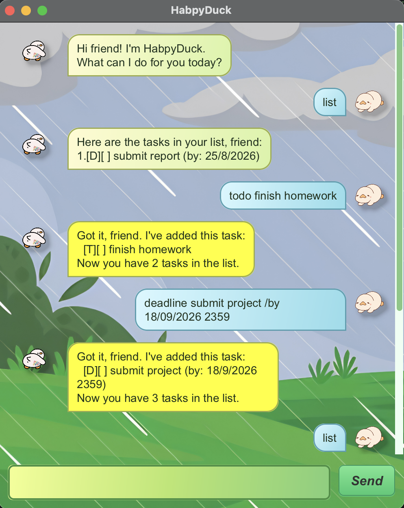

# HabpyDuck User Guide

HabpyDuck is a friendly task-tracking chatbot that helps you remember todos, deadlines, and events.

## Quick Start

1. Install JDK 25 or later.
2. Download `habpyduck.jar` from the latest release.
3. Put `habpyduck.jar` in the folder where you want HabpyDuck to store its data.
4. Open a terminal in that folder and run:

   ```bash
   java -jar habpyduck.jar
   ```

5. Wait for the HabpyDuck window to appear.
6. Enter a command and press Enter or click **Send**.
7. Try these commands first:

   ```text
   todo read the user guide
   list
   ```

If HabpyDuck does not start, check that `habpyduck.jar` is in the current folder and rerun
`java -jar habpyduck.jar`.

HabpyDuck starts with an empty task list on first use. Your tasks are saved automatically after changes.

## Understanding Command Formats

This guide uses these conventions:

- `UPPER_CASE` words are values you provide, such as a task description or task number.
- `[square brackets]` show optional parts.
- `...` means you can repeat the previous part.
- Commands should be entered one line at a time.
- Command words and markers such as `/by`, `/from`, and `/to` must be typed exactly as shown.

For example, in `deadline DESCRIPTION /by DD/MM/YYYY [HHmm]`, replace `DESCRIPTION`, `DD/MM/YYYY`, and `HHmm`
with your own task details, but type `deadline` and `/by` exactly as shown.

## Command Summary

| Action | Command format |
| --- | --- |
| Add a todo | `todo DESCRIPTION` |
| Add a deadline | `deadline DESCRIPTION /by DD/MM/YYYY [HHmm]` |
| Add an event | `event DESCRIPTION /from DD/MM/YYYY [HHmm] /to DD/MM/YYYY [HHmm]` |
| List tasks | `list` |
| Mark a task as done | `mark TASK_NUMBER` |
| Mark a task as not done | `unmark TASK_NUMBER` |
| Delete a task | `delete TASK_NUMBER` |
| Find tasks by keyword | `find KEYWORD` |
| Add tags | `tag TASK_NUMBER #TAG...` |
| Remove a tag | `untag TASK_NUMBER #TAG` |
| Find tasks by tag | `findtag #TAG` |
| Exit | `bye` |

Task numbers are shown by the `list`, `find`, and `findtag` commands.

## Features

### Add a todo: `todo`

Use `todo` for a task without a date or time.

```text
todo read book
```

Expected response:

```text
Got it, friend. I've added this task:
  [T][ ] read book
Now you have 1 tasks in the list.
```

### Add a deadline: `deadline`

Use `deadline` for a task that is due on a specific date. The date must use `DD/MM/YYYY`. Time is optional and uses
`HHmm`.

```text
deadline return book /by 25/8/2026
deadline submit report /by 25/8/2026 1800
```

Expected response:

```text
Got it, friend. I've added this task:
  [D][ ] submit report (by: 25/8/2026 1800)
Now you have 2 tasks in the list.
```

### Add an event: `event`

Use `event` for a task with a start and end date and time. Both `/from` and `/to` must use `DD/MM/YYYY`; their
times are optional and use `HHmm`. The start must be earlier than the end.

```text
event orientation /from 20/9/2026 /to 25/9/2026
event project meeting /from 25/8/2026 1400 /to 25/8/2026 1600
event hackathon /from 20/9/2026 0900 /to 21/9/2026
```

Expected response:

```text
Got it, friend. I've added this task:
  [E][ ] project meeting (from: 25/8/2026 1400 to: 25/8/2026 1600)
Now you have 3 tasks in the list.
```

### List tasks: `list`

Use `list` to see all saved tasks.

```text
list
```

Expected response:

```text
Here are the tasks in your list, friend:
1.[T][ ] read book
2.[D][ ] submit report (by: 25/8/2026 1800)
3.[E][ ] project meeting (from: 25/8/2026 1400 to: 25/8/2026 1600)
```

### Mark and unmark tasks: `mark`, `unmark`

Use `mark` when a task is done, and `unmark` when it is not done yet.

```text
mark 1
unmark 1
```

If the task is already in the requested status, HabpyDuck will remind you instead of changing the list.

### Delete a task: `delete`

Use `delete` to remove a task from the list.

```text
delete 2
```

Expected response:

```text
Got it, friend. I've removed this task:
  [D][ ] submit report (by: 25/8/2026 1800)
Now you have 2 tasks in the list.
```

### Find tasks: `find`

Use `find` to search task descriptions. The search is case-insensitive.

```text
find book
```

Expected response:

```text
I found these matching tasks for you, friend:
1.[T][ ] read book
```

### Tag tasks: `tag`, `untag`, `findtag`

Tags help you group tasks. A tag must start with `#` and can contain letters, numbers, hyphens, and underscores.
Tags are stored in lowercase, so `#School` and `#school` are treated as the same tag.

```text
tag 1 #school #reading
findtag #school
untag 1 #reading
```

Expected response for `findtag #school`:

```text
I found these tasks with that tag, friend:
1.[T][ ] read book #school #reading
```

### Exit: `bye`

Use `bye` to close HabpyDuck. In the GUI, HabpyDuck shows the farewell message and closes after a short pause.

```text
bye
```

Expected response:

```text
Bye friend. Hope to see you again soon!
```

## Command Tips

- Use `list` before `mark`, `unmark`, or `delete` if you are unsure of the task number.
- Use `/by`, `/from`, and `/to` exactly as shown in the command formats.
- If HabpyDuck cannot understand a command, it will show a friendly error message and leave your task list unchanged.
